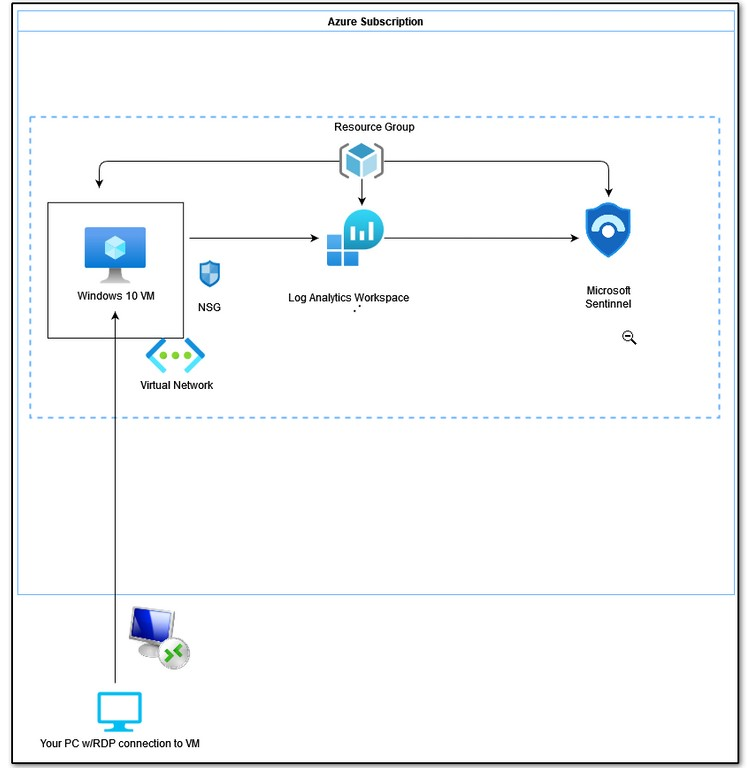

# Azure Foundation

## Overview

This project establishes the foundational Azure environment used throughout this security portfolio.

The objective was to build the core cloud infrastructure required for security monitoring, threat detection, and incident investigation using Microsoft security technologies.

The environment provides the foundation for:

- Centralised security logging
- Cloud security monitoring
- Endpoint telemetry collection
- Threat detection
- Incident response investigations
- Future attack simulation scenarios

---

# Objectives

This project focuses on:

- Understanding Azure resource organisation
- Configuring foundational Azure security resources
- Deploying Log Analytics for centralised telemetry collection
- Enabling Microsoft Sentinel for SIEM capabilities
- Connecting Azure and Windows security data sources
- Configuring security auditing and logging
- Validating collected telemetry using KQL queries

---

# Architecture

The environment consists of:

- Azure resources used as monitored workloads
- Log Analytics Workspace for log collection
- Microsoft Sentinel for security monitoring and investigation
- Windows security logging for endpoint telemetry

---

# Implementation

## 1. Azure Resource Configuration

Core Azure resources were created to provide the foundation for security monitoring activities.

Resource Groups provide logical organisation and management of related Azure resources.

---

## 2. Log Analytics Workspace

A Log Analytics Workspace was deployed to collect and analyse security telemetry from connected Azure resources.

The workspace acts as the central location where logs are stored and queried using KQL.

It provides the data foundation required for Microsoft Sentinel monitoring and investigation.

---

## 3. Microsoft Sentinel Deployment

Microsoft Sentinel was enabled to provide SIEM capabilities including security monitoring, investigation, and threat detection.

Sentinel uses collected telemetry to identify suspicious activity, generate alerts, and support incident investigation workflows.

---

## 4. Security Data Connectors

Data connectors were configured to ingest security telemetry from Azure and Windows sources.

These connectors allow Microsoft Sentinel to receive security events from connected services and make them available for analysis.

---

## 5. Virtual Machine Telemetry

The Azure Virtual Machine was connected to monitoring services to verify that security events were being collected.

This provided an endpoint source for generating and investigating security events.

---

## 6. Windows Security Logging

Windows auditing policies were enabled to generate security events for monitoring and investigation.

Security logs provide visibility into authentication activity, system changes, and potential suspicious behaviour.

---

## 7. KQL Log Validation

KQL queries were used to verify that security telemetry was successfully ingested into the Log Analytics Workspace.

Example validation checks included:

- Confirming log ingestion
- Reviewing security events
- Verifying available telemetry sources

---

# Key Learnings

Through this project, I developed practical experience with:

- Building a foundational Azure security environment
- Understanding how Azure resources support security operations
- Deploying Microsoft Sentinel and Log Analytics
- Connecting security telemetry sources
- Configuring Windows security logging
- Using KQL to validate and analyse security data

This foundation supports the later portfolio sections covering identity security, network security, threat detection, attack simulation, and incident response.