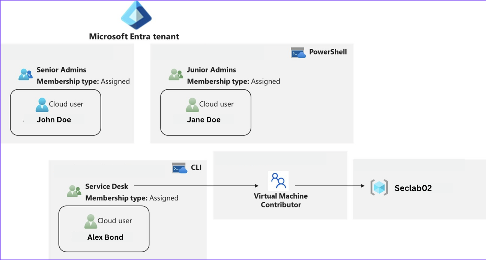
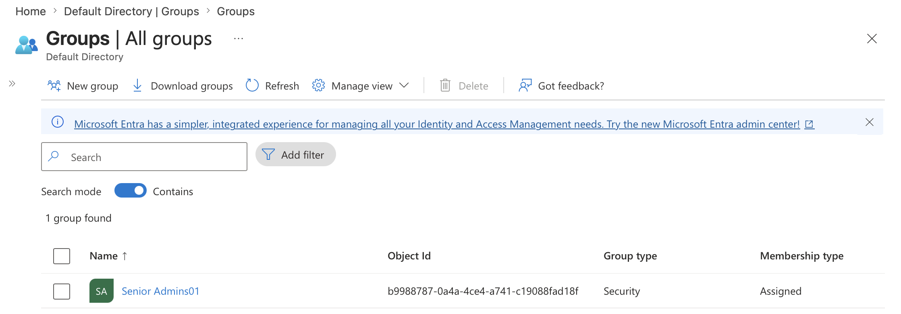
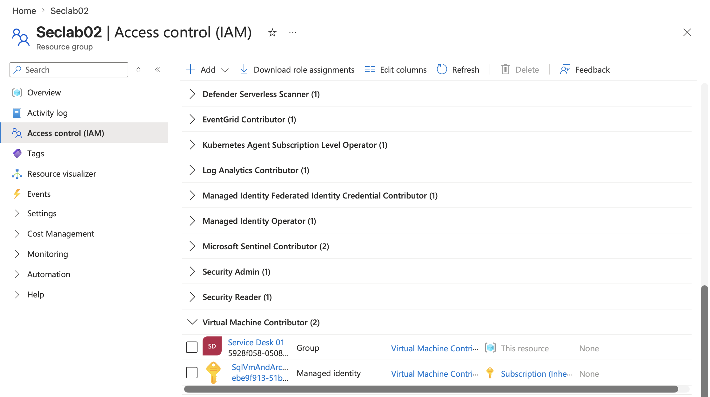
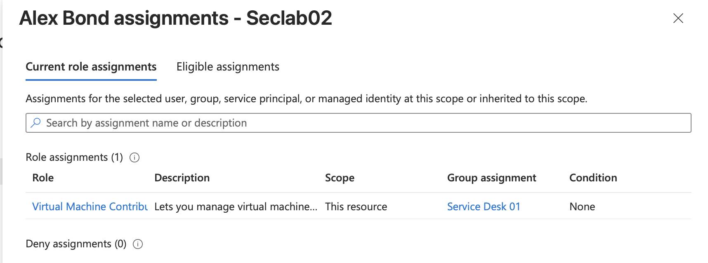
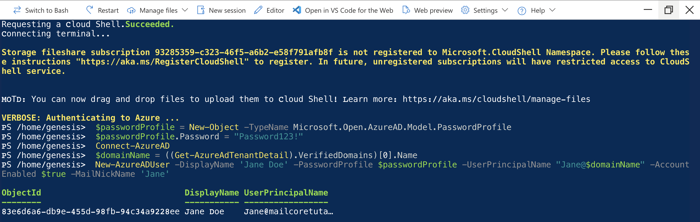
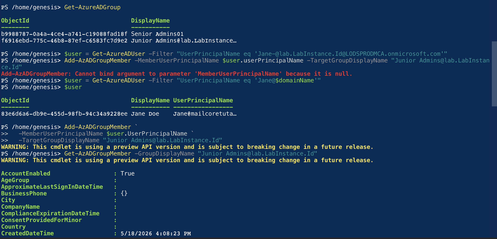
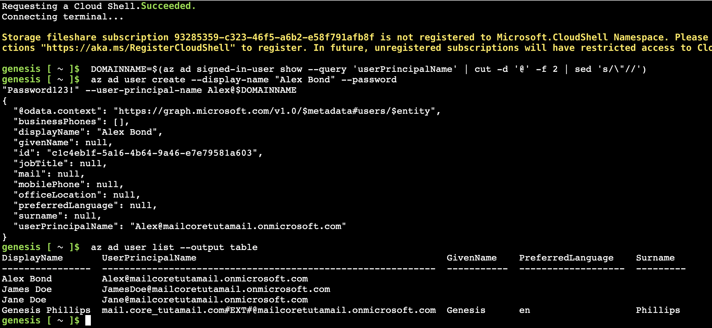
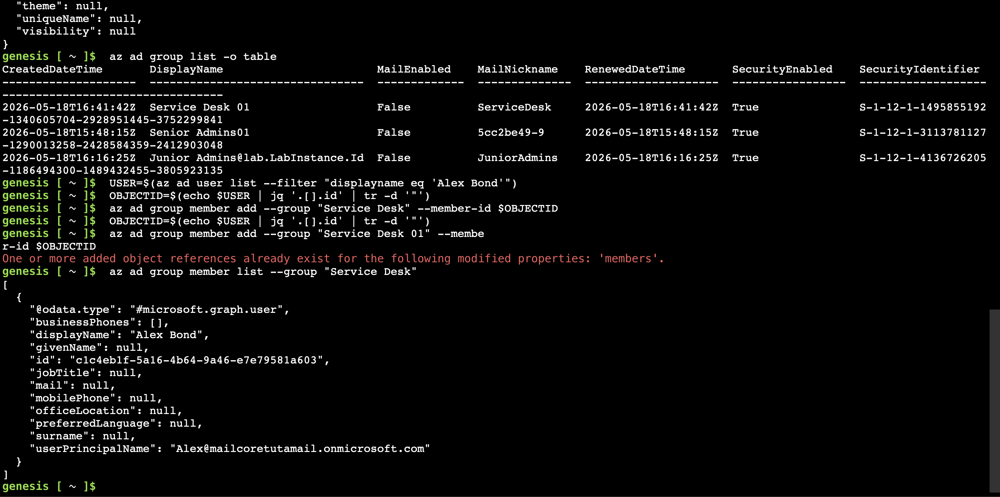

# RBAC & Least Privilege

## Overview

Identity is one of the most important security controls in cloud environments. This project focuses on securing Azure access using Microsoft Entra ID groups and Azure Role-Based Access Control (RBAC).

The objective was to implement a least privilege access model where permissions are assigned based on job responsibilities rather than individual users.

This project demonstrates how identity security controls can reduce:

- Excessive permissions
- Unauthorised access
- Privilege escalation risk
- Poor access management practices

---

# Scenario

A company requires a Service Desk team to manage Azure Virtual Machines as part of their daily responsibilities.

Instead of assigning permissions directly to individual users, an identity-based access model was implemented using Microsoft Entra ID security groups and Azure RBAC.

The goal was to provide the required access while limiting unnecessary privileges.

---

# Objectives

This project focuses on:

- Understanding Azure identity and access management concepts
- Implementing Microsoft Entra ID security groups
- Applying Azure RBAC using least privilege principles
- Reducing direct user permissions
- Creating a scalable access management model
- Validating effective permissions

---

# Identity Security Architecture

The access model follows a group-based RBAC approach:

User → Microsoft Entra ID Security Group → Azure RBAC Role Assignment → Azure Resource Access

Permissions are assigned to groups rather than individual users, improving security and maintainability.

---

# Technologies Used

- Microsoft Entra ID
- Azure Role-Based Access Control (RBAC)
- Azure Portal
- Azure PowerShell
- Azure CLI

---

# Implementation

## 1. Microsoft Entra ID Security Groups

Security groups were created to represent different operational responsibilities.

Using groups instead of direct user assignments allows permissions to be managed centrally and reduces administrative overhead.

---

## 2. Group-Based RBAC Assignment

Azure RBAC permissions were assigned to groups instead of individual users.

The Service Desk group was assigned the **Virtual Machine Contributor** role.

This provides:

- Virtual machine management capabilities
- Required operational access
- No unnecessary subscription-level permissions

---

## 3. Administrative Management Workflows

Azure access management was performed using multiple administration methods:

### Azure PowerShell

PowerShell was used to demonstrate repeatable identity and access management workflows.

### Azure CLI

Azure CLI was used to manage RBAC assignments and validate configuration through command-line workflows.

---

# Architecture Decisions

## Group-Based Access Control

Permissions were assigned to security groups rather than individual users.

Benefits:

- Easier access management
- Improved auditing
- Reduced permission drift
- Better scalability

---

## Least Privilege Access

The Service Desk role was limited to the permissions required for daily responsibilities.

The Virtual Machine Contributor role was selected because:

- The team requires VM management capabilities
- They do not require full administrative access
- Subscription-level permissions would increase security risk

---

## Separation of Duties

Administrative responsibilities were separated to reduce the impact of compromised accounts.

Limiting permissions based on job function supports Zero Trust security principles.

---

# Validation

The configuration was validated by:

- Confirming users inherited permissions through group membership
- Reviewing Azure RBAC role assignments
- Verifying the Service Desk group had VM management access
- Confirming unnecessary administrative permissions were not assigned

---

# Key Learnings

Through this project, I developed practical experience with:

- Microsoft Entra ID identity management
- Azure RBAC implementation
- Least privilege access control
- Group-based permission management
- Identity security principles
- Azure PowerShell and Azure CLI administration

This project demonstrated how effective identity management reduces security risk by controlling who can access Azure resources and what actions they are allowed to perform.
