# Network Security

## Overview

This project demonstrates how Azure network security controls can be implemented to protect cloud workloads, restrict unauthorised access, and control traffic flow.

The objective was to design a layered network security approach using Azure networking services including Virtual Networks, Network Security Groups (NSGs), Application Security Groups (ASGs), and Azure Firewall.

The security controls implemented in this project help:

- Reduce attack surface
- Control network access
- Limit unnecessary communication between resources
- Restrict lateral movement opportunities
- Improve visibility and control over network traffic

---

# Scenario

A company hosts multiple workloads within an Azure environment and requires network security controls to protect resources from unauthorised access.

The objective was to implement a defence-in-depth network security model where traffic is controlled at multiple layers:

Internet → Azure Firewall (Centralised traffic filtering) → Network Security Groups (Network access control) → Application Security Groups (Workload-based grouping) → Azure Resources (Virtual Machines)

---

# Objectives

This project focuses on:

- Designing a secure Azure network foundation
- Implementing network segmentation
- Controlling inbound and outbound traffic
- Applying least privilege network access
- Configuring Azure Firewall traffic inspection
- Validating network security controls

---

# Architecture

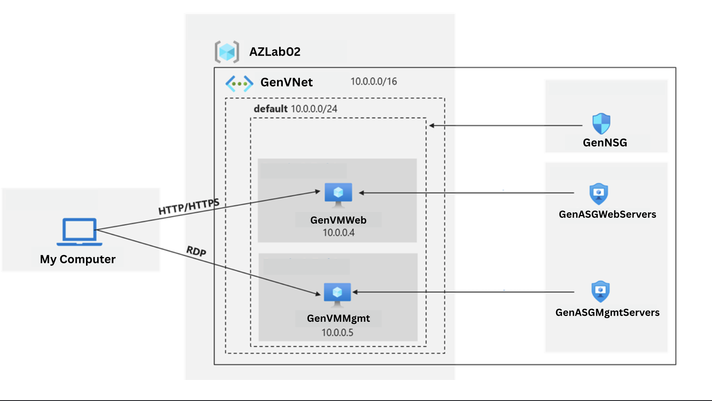

The environment uses multiple Azure security controls to provide layered protection:

| Security Control | Purpose |
|---|---|
| Virtual Network | Provides isolated Azure networking |
| Subnets | Organise and separate workloads |
| Application Security Groups | Group resources based on function |
| Network Security Groups | Control allowed network traffic |
| Azure Firewall | Centralised traffic filtering and inspection |
| Route Tables | Control traffic flow through security appliances |

---

# Implementation

## 1. Virtual Network and Network Segmentation

A Virtual Network was created to provide an isolated network boundary for Azure resources.

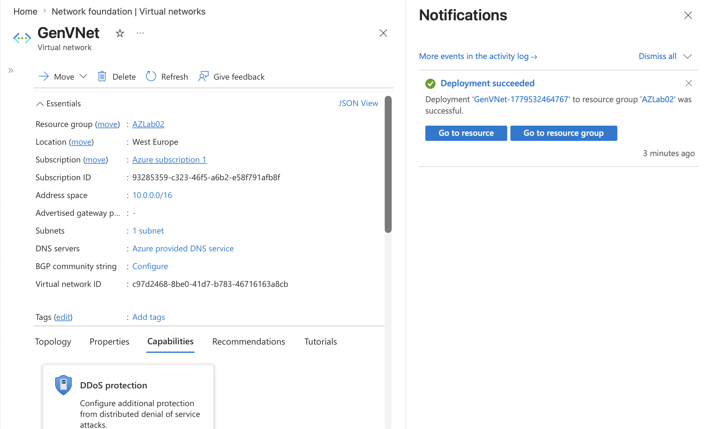

The network design provides the foundation for applying security controls and controlling communication between workloads.

---

# 2. Application Security Groups (ASGs)

Application Security Groups were created to logically group workloads based on their function.

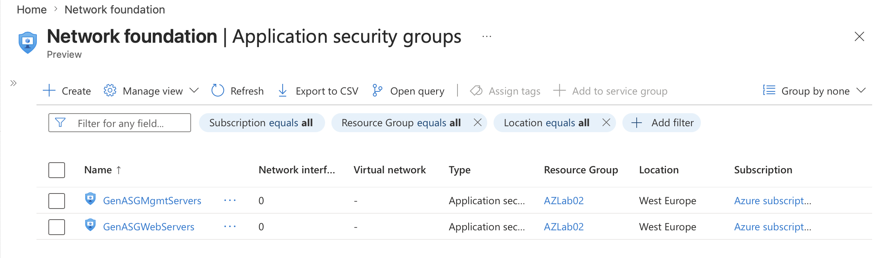

ASGs allow security rules to be applied based on workload roles rather than individual IP addresses.

Example:

- Web servers
- Management servers
- Internal workloads

This improves scalability and simplifies security management.

---

# 3. Network Security Groups (NSGs)

Network Security Groups were implemented to control inbound and outbound traffic at the subnet level.

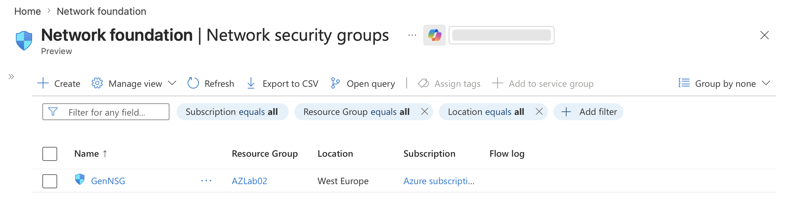

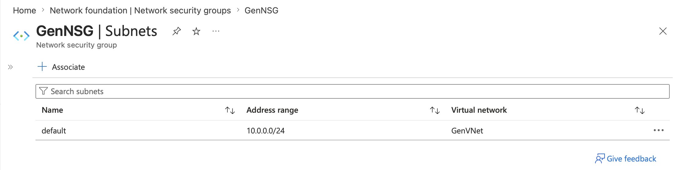

NSG rules were created to allow only required communication paths.

Example controls:

- Allow web traffic to public-facing workloads
- Restrict management access
- Block unnecessary network communication

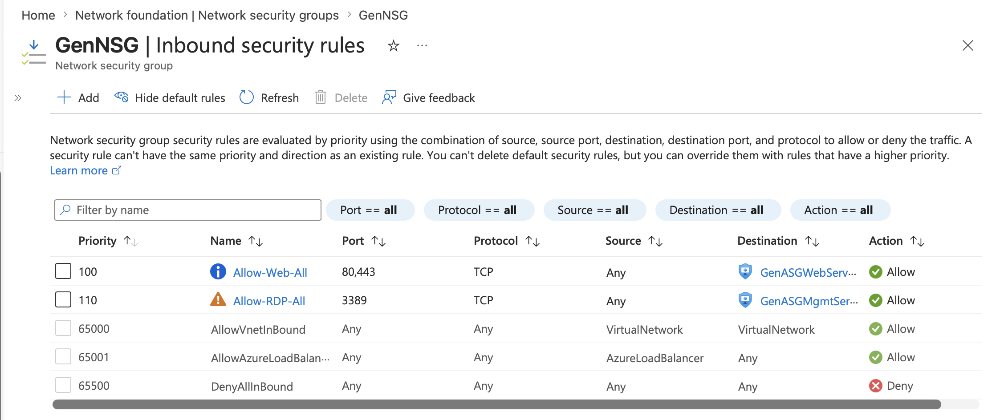

---

# 4. Azure Firewall Deployment

Azure Firewall was deployed to provide centralised traffic filtering and control.

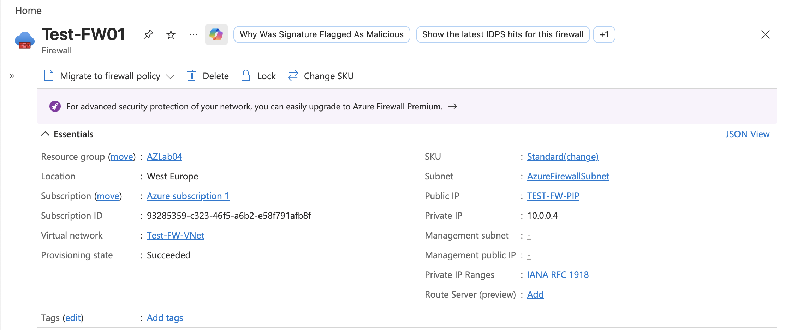

Azure Firewall provides:

- Application filtering
- Network traffic filtering
- Centralised security policy management
- Controlled internet access

---

# 5. Traffic Routing and Firewall Rules

Route tables were configured to direct traffic through Azure Firewall for inspection.

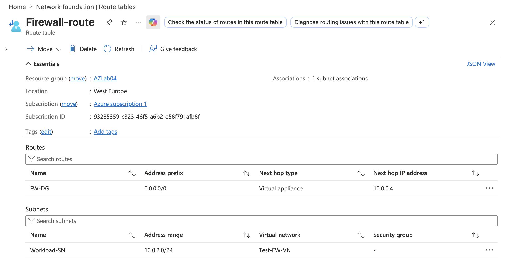

Firewall policies were created using:

## Application Rules

Application rules control access based on fully qualified domain names (FQDNs).

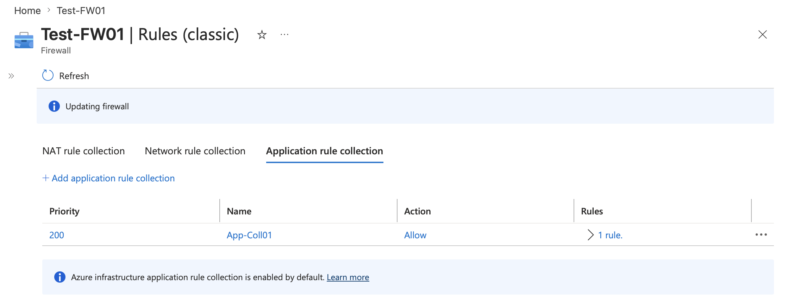

## Network Rules

Network rules control traffic using:

- Source addresses
- Destination addresses
- Ports
- Protocols

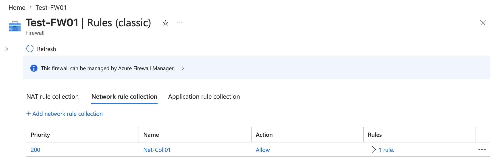

## DNS Configuration

DNS settings were configured to support domain resolution and firewall policy enforcement.

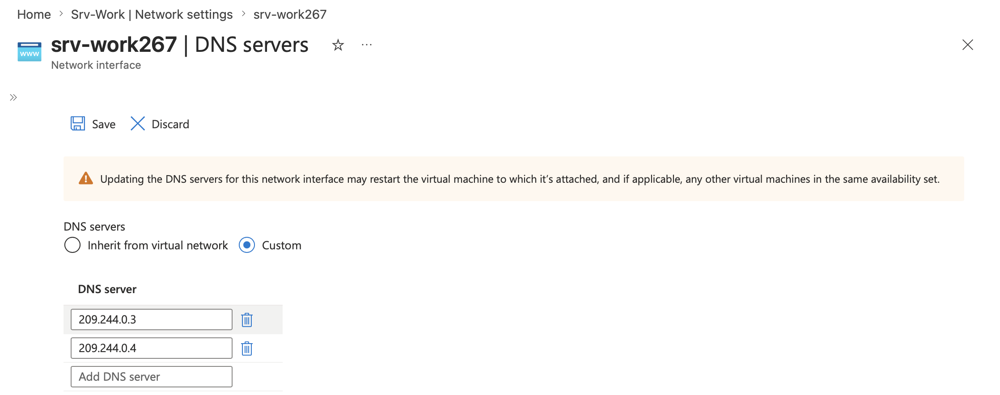

---

# Validation

The network security controls were tested to confirm that traffic restrictions were working as expected.

Validation included:

## Management Access Testing

Connected to the management virtual machine using Remote Desktop.

## Firewall Policy Testing

Tested outbound access from the internal workload.

Expected results:

- Allowed websites successfully loaded
- Restricted websites were blocked by firewall policy

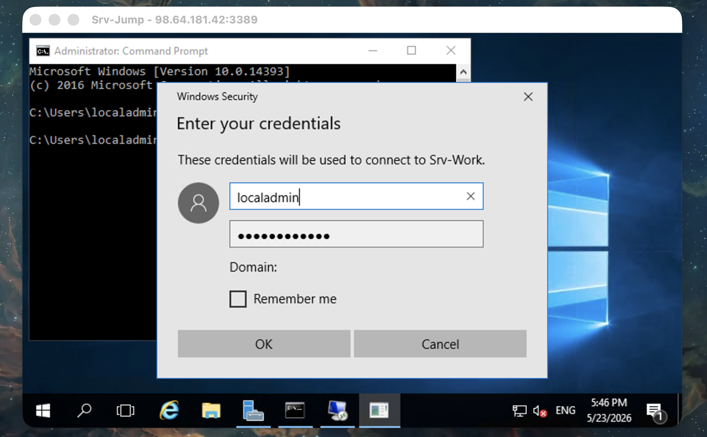

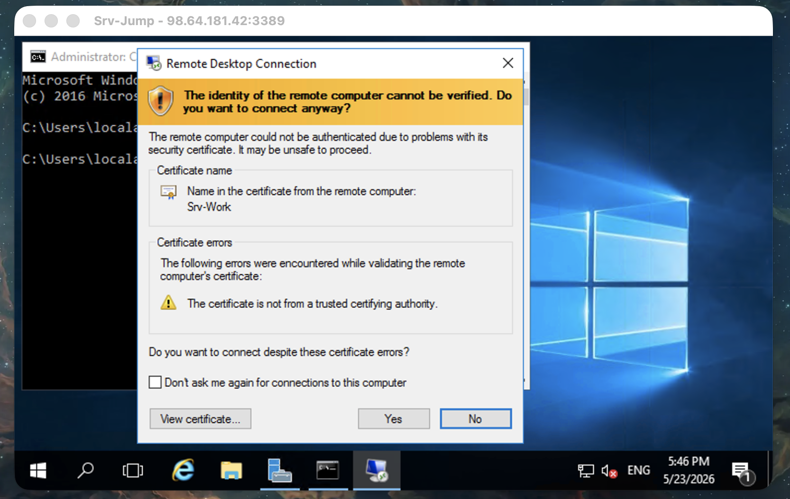

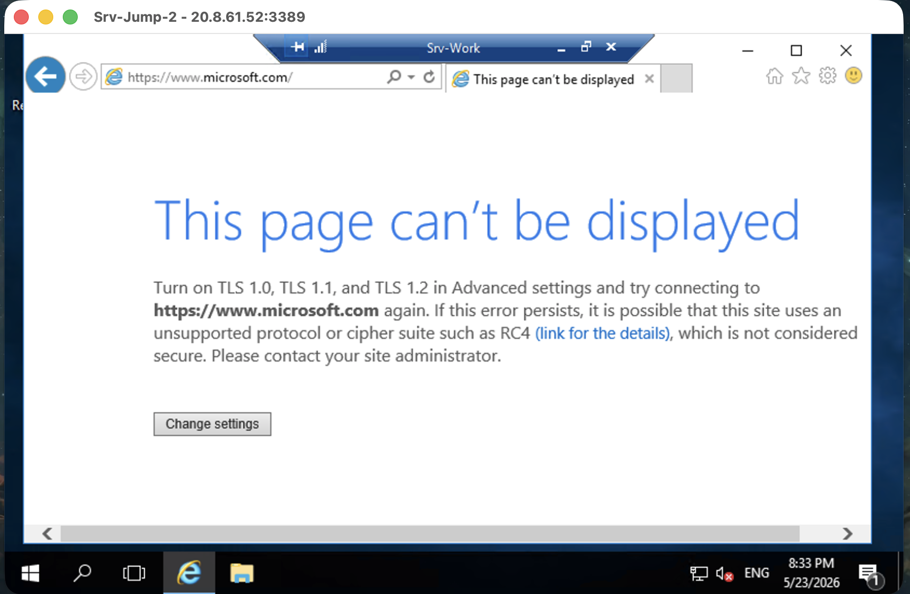

---

# Architecture Decisions

## Layered Network Security

Multiple security controls were implemented rather than relying on a single defence mechanism.

This provides defence in depth by combining:

- Network segmentation
- Access filtering
- Traffic inspection
- Controlled routing

---

## Least Privilege Networking

Only required traffic was allowed between resources.

Restricting unnecessary access reduces:

- Attack surface
- Exposure of services
- Potential lateral movement paths

---

## Centralised Traffic Inspection

Azure Firewall was implemented as a central security control point for monitoring and controlling network traffic.

This provides greater visibility and consistency compared to managing individual workload rules.

---

# Key Learnings

Through this project, I developed practical experience with:

- Azure networking fundamentals
- Virtual Network design
- Network Security Groups
- Application Security Groups
- Azure Firewall configuration
- Traffic routing and filtering
- Network security best practices

This project demonstrated how layered network security controls can protect Azure workloads by controlling communication paths and reducing unnecessary exposure.