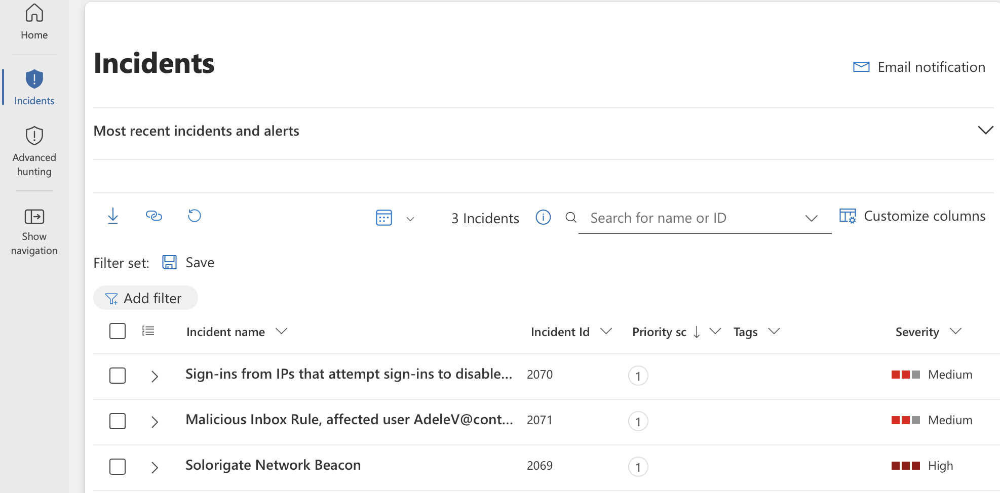
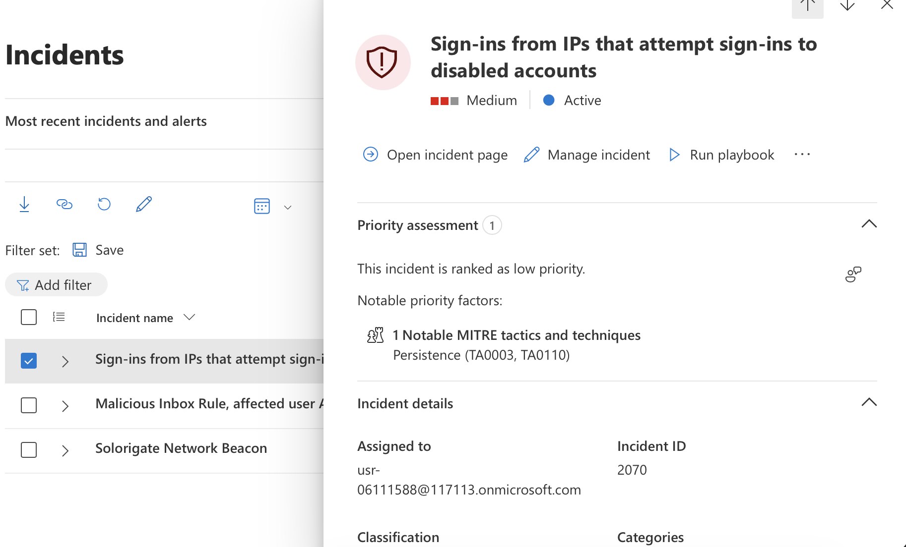
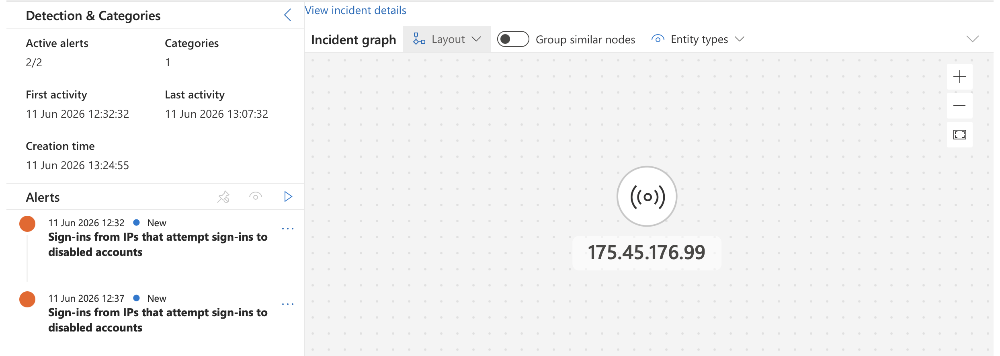
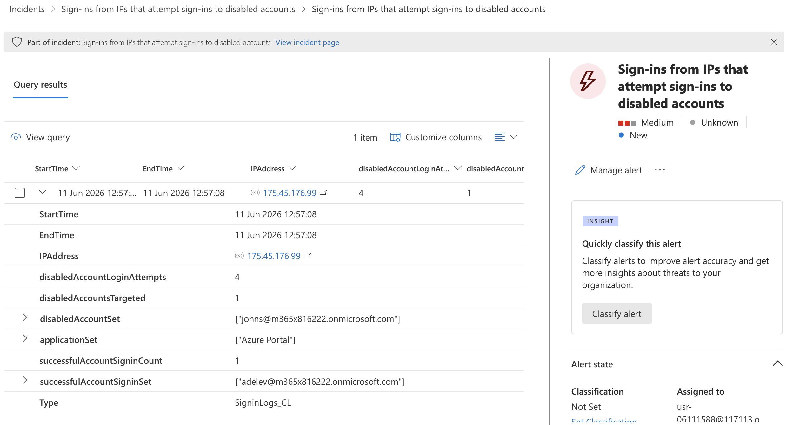
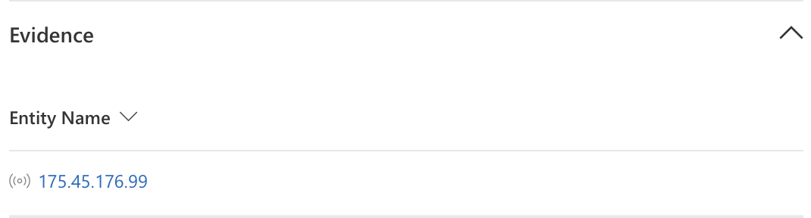
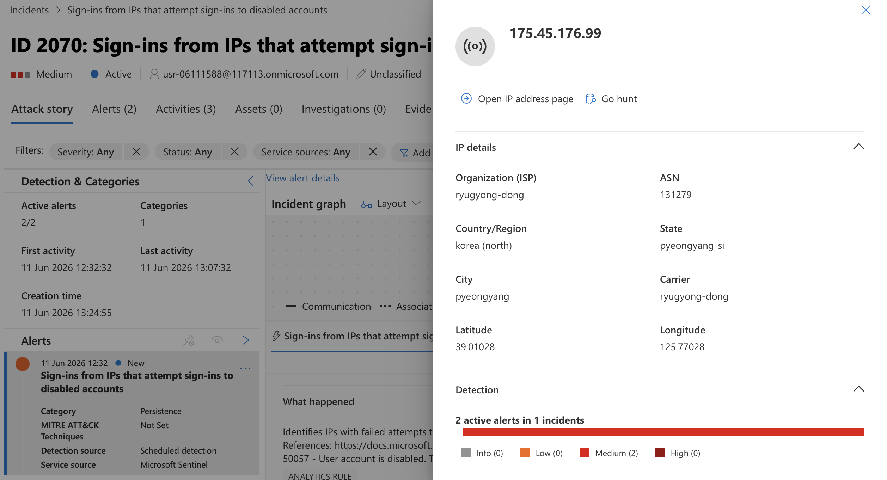
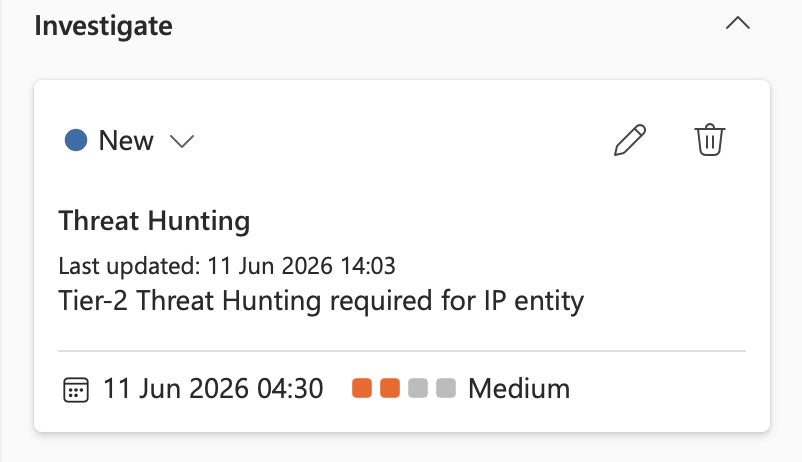

# Microsoft Sentinel Alert Investigation

## Overview

This project demonstrates how Microsoft Sentinel is used within a SOC environment to investigate security alerts, analyse suspicious activity, and support incident triage.

The investigation focuses on reviewing security alerts, analysing authentication activity, correlating events using Log Analytics and KQL, identifying indicators of compromise (IOCs), and documenting findings for escalation.

---

## Scenario

Microsoft Sentinel generated a **medium-severity security incident** after detecting repeated sign-in attempts from an external IP address targeting disabled user accounts.

The objective of the investigation was to determine:

- Whether the activity represented a genuine security concern
- The scope and impact of the activity
- The affected users and resources
- Whether further investigation or escalation was required

---

## Azure Services Used

- **Microsoft Sentinel (SIEM)**  
  Security alert monitoring, incident investigation, entity analysis, and threat detection.

- **Log Analytics Workspace**  
  Centralised collection and analysis of security telemetry.

- **Microsoft Entra ID**  
  Identity and authentication log analysis.

- **Azure Monitor**  
  Monitoring and visibility into Azure activity.

---

# Investigation Workflow

The investigation followed a typical SOC analyst process:

Alert Generated → Initial Alert Triage → Review Incident Details & Entities → Analyse Authentication Logs → Identify Indicators of Compromise → Assess Severity & Impact → Escalate Findings

---

# Investigation Summary

I assumed ownership of a Microsoft Sentinel incident titled:

**"Sign-ins from IPs that attempt sign-ins to disabled accounts"**

The incident contained multiple authentication attempts targeting disabled user accounts from an external IP address.

The initial objective was to determine whether this activity represented:

- Automated scanning
- Credential attack activity
- Malicious authentication attempts
- False positive behaviour

---

# Investigation Process

## 1. Incident Review and Initial Triage

The incident details were reviewed to understand the alert context, including:

- Incident severity
- Associated alerts
- Affected entities
- Event timestamps
- MITRE ATT&CK mappings

This provided an overview of why the alert was triggered and identified the areas requiring further investigation.

---

## 2. Timeline and Activity Analysis

The incident timeline was analysed to understand the sequence and frequency of authentication events.

The investigation focused on:

- Source IP address activity
- Targeted user accounts
- Authentication attempts
- Event timing and patterns

This helped determine whether the activity aligned with normal behaviour or required further investigation.

---

## 3. Log Investigation Using Log Analytics

To validate the alert, I pivoted into Log Analytics and reviewed the underlying authentication data.

The investigation focused on:

- Source IP address
- Target user accounts
- Authentication results
- Related sign-in activity

KQL queries were used to review available telemetry and confirm the activity observed within Microsoft Sentinel.

---

## 4. Entity Investigation

The associated entities were investigated, including the suspicious IP address and affected user accounts.

Additional context was gathered through:

- IP information
- Geolocation data
- Account details
- Related authentication activity

This helped assess whether the activity matched expected behaviour or represented suspicious access attempts.

---

## 5. Investigation Outcome

After correlating evidence from:

- Microsoft Sentinel alerts
- Microsoft Entra ID sign-in logs
- Entity information
- Authentication events

The activity was determined to require further investigation.

Findings were documented, an escalation task was created, and the incident was assigned to the SOC Level 2 team for additional threat hunting and analysis.

---

# Key Findings (IOCs & Evidence)

| IOC Type | Evidence | Relevance |
|-----------|-----------|-----------|
| Source IP Address | 175.45.176.99 | Generated multiple authentication attempts |
| User Account | Disabled account(s) | Targeted during suspicious sign-in activity |
| Alert Name | Sign-ins from IPs that attempt sign-ins to disabled accounts | Detection source that initiated investigation |
| Authentication Events | Multiple failed sign-in attempts | Indicated suspicious authentication behaviour |
| Geolocation Data | External location | Provided additional context during investigation |

---

# Security Recommendations

Based on the investigation findings, the following improvements were recommended:

- Continue monitoring authentication activity associated with the identified IP address.
- Perform additional threat hunting to identify similar authentication attempts across the environment.
- Review monitoring coverage for suspicious authentication activity.
- Enrich authentication alerts with threat intelligence and IP reputation data.
- Regularly review and tune detection rules to improve alert accuracy.

---

# Key Learnings

Through this investigation, I developed practical experience with:

- Microsoft Sentinel incident investigation
- SOC alert triage workflows
- Authentication log analysis
- KQL-based investigation techniques
- Entity and IOC investigation
- MITRE ATT&CK mapping
- Security incident escalation processes

This project demonstrated how Microsoft Sentinel can provide visibility into cloud identity activity and support analysts in detecting, investigating, and escalating suspicious behaviour within an Azure environment.