# Attack Simulation & Security Validation

## Overview

This project explores how Microsoft Defender security tools can be used to detect, investigate, and validate security controls through controlled attack simulations.

The purpose of these simulations is to understand common attacker techniques from a defensive security perspective, analyse the telemetry generated during malicious activity, and evaluate how Microsoft security solutions identify and respond to threats.

The project focuses on the relationship between attacker behaviour and defensive visibility, helping develop practical skills in:

- Threat detection
- Security investigation
- Alert analysis
- MITRE ATT&CK mapping
- Security control validation

---

## Objectives

This project focuses on:

- Understanding common attacker techniques used against enterprise environments
- Learning how attacker activity appears from a defender's perspective
- Using Microsoft Defender security tools to analyse suspicious behaviour
- Reviewing security alerts and investigation data
- Mapping simulated activity to MITRE ATT&CK techniques
- Developing practical threat detection and response skills
- Identifying opportunities to improve security controls

---

## Technologies Used

- Microsoft Defender XDR
- Microsoft Defender for Cloud
- Microsoft Sentinel
- Microsoft Entra ID
- Azure Virtual Machines
- Windows Security Logs
- MITRE ATT&CK Framework

---

## Microsoft Defender XDR Foundation

Before conducting the attack simulations, I developed a foundational understanding of Microsoft Defender XDR and how it supports security operations.

The focus was on understanding how Defender XDR brings security signals together across Microsoft security products to provide a centralised view of threats, incidents, users, and devices.

I also reviewed:

- Defender XDR architecture and security signal integration
- Unified Role-Based Access Control (RBAC)
- Incident and alert investigation workflows
- Security and investigation areas within the Defender portal

### Why This Matters

For a SOC analyst, effective use of Defender XDR is not simply about identifying an alert. It requires understanding how different security signals relate to each other and using that context to determine whether activity represents a genuine threat.

This foundation provides the context for the attack simulations that follow, where I investigate how different attacker techniques appear within Defender telemetry and how those signals can support detection and investigation.

---
## Simulation Methodology

Each attack simulation will follow a defensive security validation approach:

Simulated Attack Technique → Security Telemetry Generated → Microsoft Defender Detection → Alert Investigation → Evidence Collection → Security Improvement Recommendations

The objective of each simulation is to understand:

- What attacker activity looks like in an environment
- What telemetry is generated during an attack
- How security tools detect suspicious behaviour
- How analysts investigate and respond to security events

---

## Simulated Attack Scenarios

### 1. Execution

#### Scenario

A controlled simulation was used to investigate a suspicious PowerShell execution event on a Windows 11 device. The activity demonstrated how attackers may use scripting and command-line tools to execute potentially malicious code.

#### Detection & Investigation

Microsoft Defender XDR generated a **medium-severity** alert for **"A script with suspicious content was observed"**.

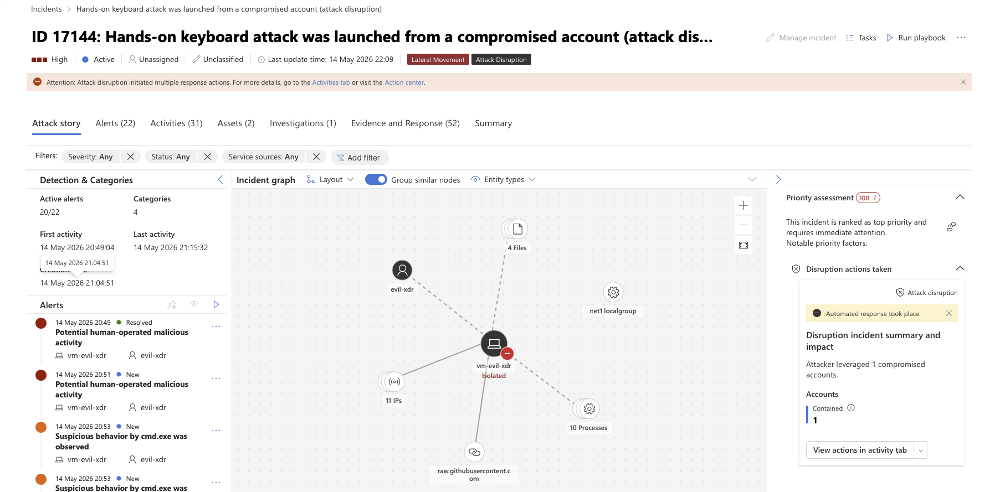

I reviewed the affected device, user account, timestamp, alert details, process activity, and command-line information to understand what had occurred.

The investigation identified suspicious behaviour involving `cmd.exe`. The command-line activity showed `csc.exe` being used to compile a C# file associated with the simulated attack. This provided additional context about how the suspicious code was executed on the device.

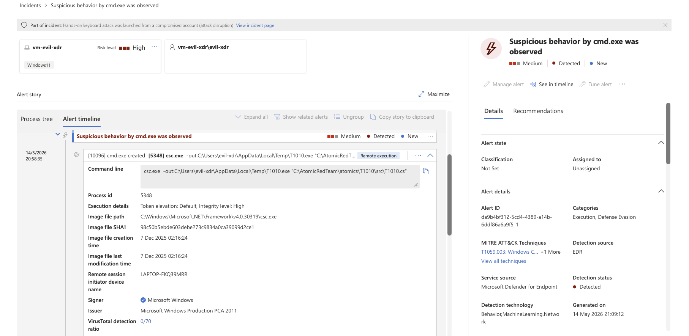

I reviewed the available script and event information to understand the activity and assess whether the execution was consistent with malicious behaviour.

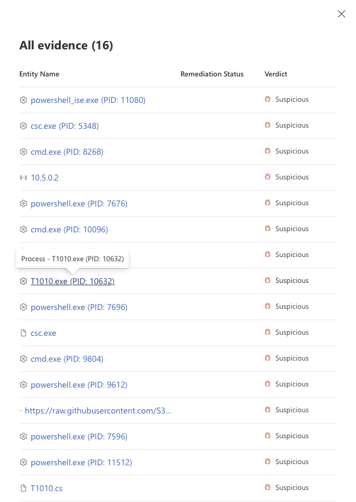

#### MITRE ATT&CK

The activity was associated with:

- **T1059.003 – Windows Command Shell**
- **T1218.014 – MMC**

These techniques fall within the MITRE ATT&CK framework and provide context for the observed execution activity.

#### Security Improvements

- Monitor suspicious PowerShell and command-line execution.
- Investigate scripts and executables running from unusual locations.
- Use endpoint protection to detect and prevent malicious script execution.
- Isolate affected devices when malicious execution is confirmed.
- Use additional investigation and threat-hunting capabilities to identify related activity.

---

### 2. Credential Access

#### Scenario

A controlled simulation was used to investigate a potential **password-spray attack** involving failed sign-in attempts and a suspicious login from an unfamiliar IP address.

The objective was to determine whether credentials were being targeted and identify any evidence of account compromise.

#### Detection & Investigation

Microsoft Defender XDR generated alerts relating to suspicious activity on a potentially compromised device.

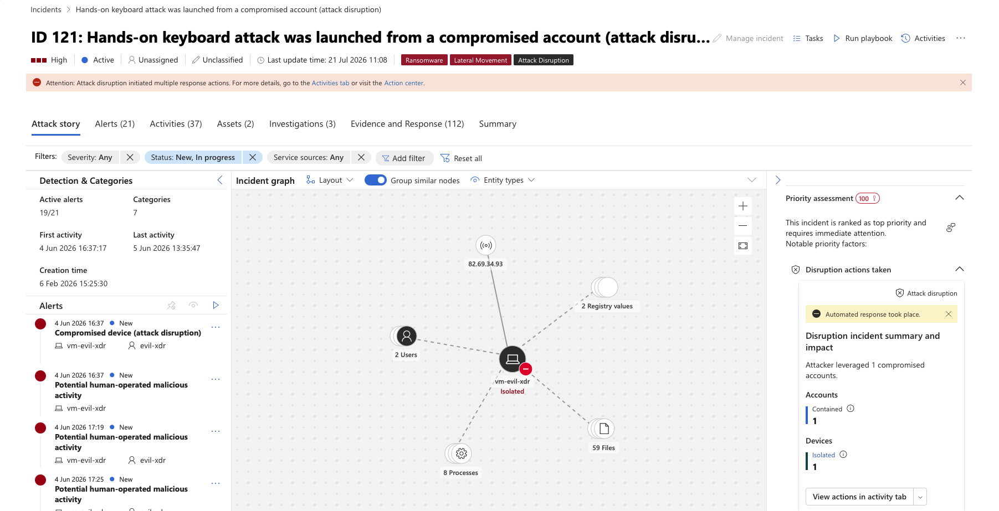

I reviewed the affected device, associated accounts, alert timeline, and available authentication and process activity.

The investigation did **not confirm a password-spray attack**. Instead, the available Defender telemetry identified a compromised account and additional suspicious activity associated with the affected device, including PowerShell activity and alerts relating to lateral movement and malware.

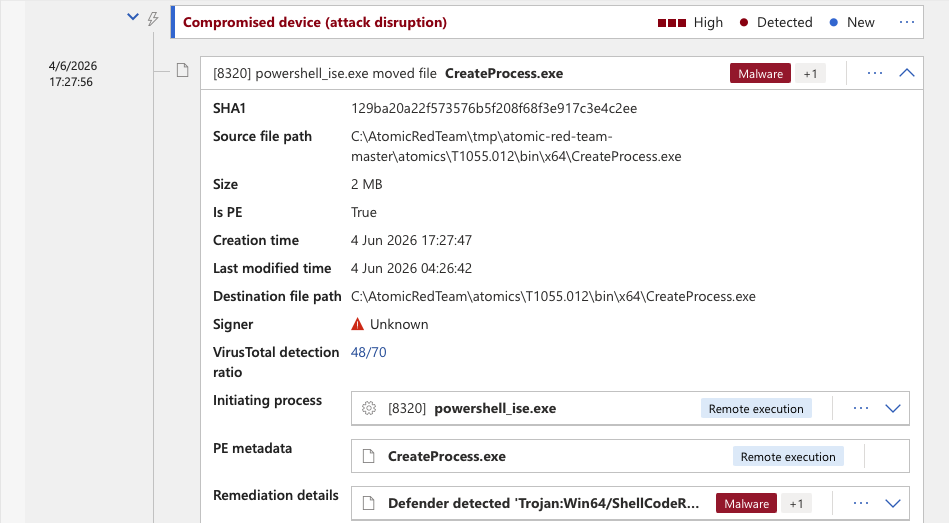

I reviewed the available investigation evidence and used Advanced Hunting to search for additional activity associated with the affected device.

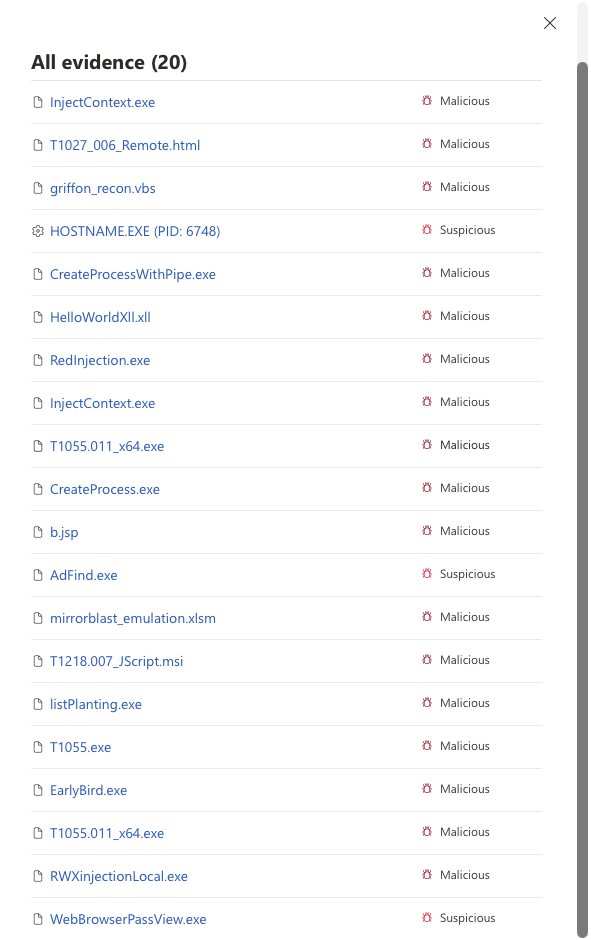

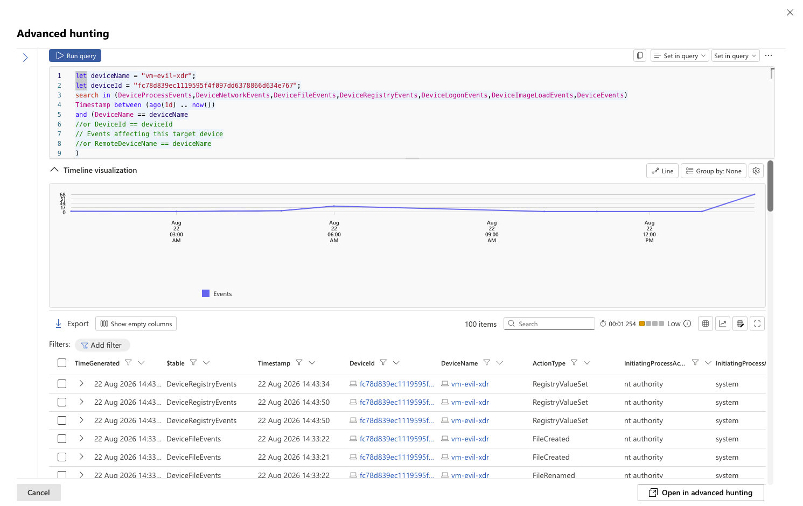

The investigation therefore shifted from validating the initial password-spray hypothesis to assessing the evidence of account compromise and related attacker activity.

#### MITRE ATT&CK

The investigation included activity associated with:

- **T1033 – System Owner/User Discovery**
- **T1087 – Account Discovery**
- **T1069 – Permission Groups Discovery**
- **T1087.001 – Local Account**
- **T1087.002 – Domain Account**

These techniques provided context for the observed activity associated with the compromised device.

#### Security Improvements

- Monitor for suspicious authentication and account activity.
- Investigate unusual PowerShell activity associated with compromised accounts.
- Use Advanced Hunting to identify related activity across affected devices.
- Isolate compromised devices when active attacker activity is confirmed.
- Use automated investigation and response capabilities to contain and remediate threats.

---

### 3. Privilege Escalation

#### Scenario

A controlled simulation was used to investigate a **User Account Control (UAC) bypass** detected on a Windows 11 device. UAC bypass techniques can allow an attacker to execute actions with elevated privileges while avoiding normal user approval prompts.

#### Detection & Investigation

Microsoft Defender XDR generated a **medium-severity** alert for **"UAC bypass was detected"**.

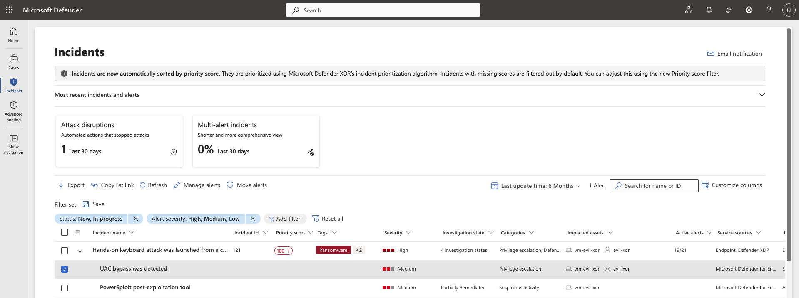

I reviewed the affected device, user account, timestamp, process activity, and investigation timeline to understand what had occurred.

The activity involved `cmd.exe` and `powershell.exe`. I reviewed the available evidence and suspicious entities before using the process tree to validate how the activity was executed.

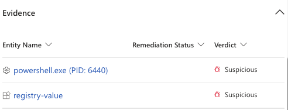

The investigation identified registry modification activity associated with the simulated UAC bypass. The process tree and timeline provided additional context to validate the detection.

#### MITRE ATT&CK

The activity was associated with:

- **T1548.002 – Bypass User Account Control**
- **T1112 – Modify Registry**

These techniques fall within the MITRE ATT&CK framework and were used to provide context for the observed activity.

#### Security Improvements

- Apply least-privilege principles to reduce the impact of compromised accounts.
- Monitor for suspicious UAC bypass and registry modification activity.
- Investigate unexpected PowerShell and command-line activity involving privilege changes.
- Keep Microsoft Defender security protections enabled and monitor attempts to bypass them.

---

### 4. Defence Evasion

#### Scenario

A controlled simulation was used to investigate an attempt to disable Microsoft Defender Antivirus protection. The activity represented a potential Defence Evasion technique because an attacker may attempt to weaken or disable security controls to avoid detection.

#### Detection & Investigation

Microsoft Defender XDR generated a **high-severity** alert for an attempt to turn off Microsoft Defender Antivirus protection.

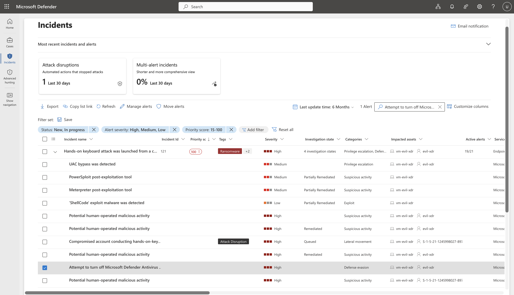

I reviewed the affected device, user account, timestamp, process activity, and command-line information to understand what had occurred.

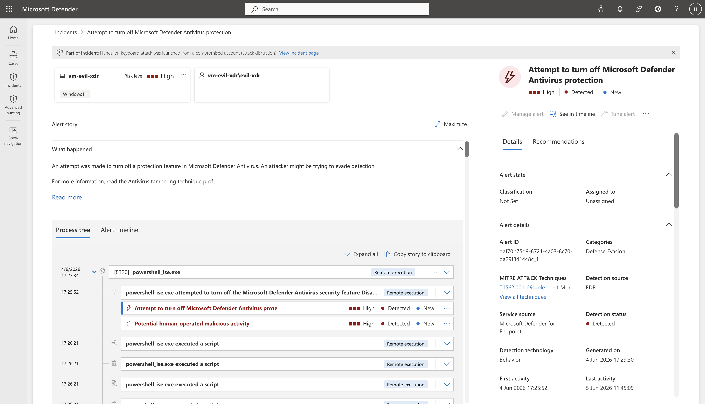

The investigation showed PowerShell activity attempting to modify the Defender Antivirus configuration through a registry change. The available telemetry provided information about the process responsible for the activity and the changes being attempted.

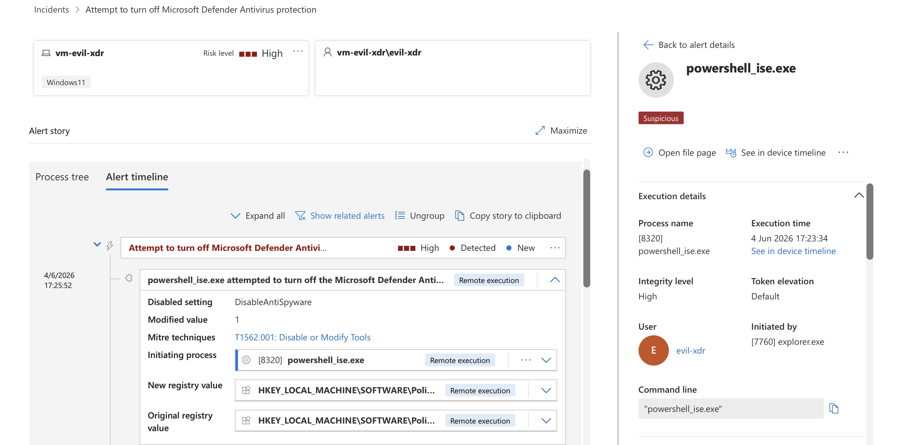

The investigation confirmed that the activity was associated with an attempt to impair Defender protections and provided process, command-line, device, and user context for further investigation.

#### MITRE ATT&CK

The activity was associated with:

- **T1562.001 – Impair Defenses: Disable or Modify Tools**
- **T1562.002 – Impair Defenses: Indicator Blocking**

These techniques fall within the Defence Evasion tactic and provide context for the observed activity.

#### Security Improvements

- Prevent unauthorised users from modifying Microsoft Defender Antivirus security settings.
- Monitor for attempts to disable or weaken Defender protections.
- Review PowerShell and registry activity associated with security-control changes.
- Investigate and escalate high-severity alerts involving attempts to impair security controls.

---

### 5. Lateral Movement

#### Scenario

A controlled simulation was used to investigate a **hands-on-keyboard attack involving a compromised account**. The activity demonstrated how an attacker may use a compromised identity to perform discovery and move through an environment.

#### Detection & Investigation

Microsoft Defender XDR generated a **high-severity** alert for **"Compromised account conducting hands-on-keyboard attack"**.

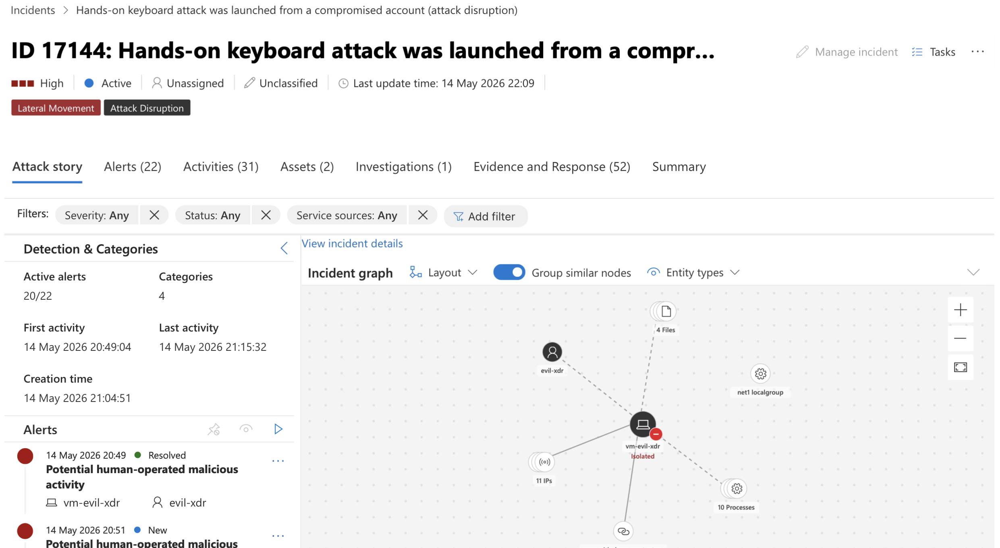

I reviewed the incident timeline, affected device, alerts, assets, and process activity to understand how the attack unfolded.

The investigation identified PowerShell activity involving domain controller discovery and additional suspicious command-line activity. Defender also detected and prevented execution of a malicious PowerShell component.

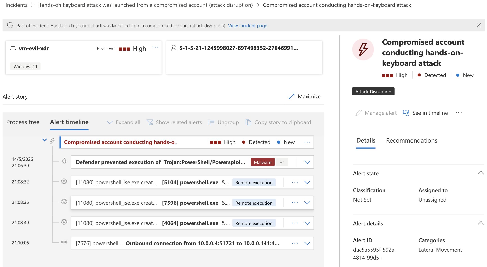

I then reviewed the available evidence to correlate the alerts, processes, and files involved in the incident and confirm the suspicious activity.

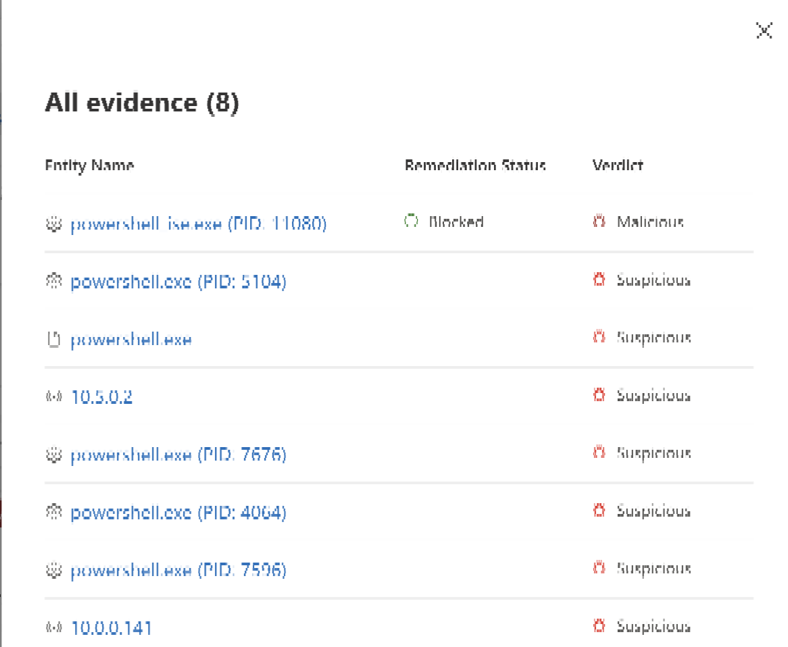

The investigation provided visibility into the sequence of activity and showed how Defender XDR correlated suspicious processes, files, and account activity within the incident.

#### MITRE ATT&CK

The activity was associated with:

- **System Owner/User Discovery**
- **Account Discovery**
- **Permission Groups Discovery**
- **Account Discovery: Local Account**
- **Account Discovery: Domain Account**

These techniques fall within the MITRE ATT&CK framework and provide context for the observed discovery and lateral movement activity.

#### Security Improvements

- Monitor for abnormal PowerShell and command-line activity.
- Investigate compromised accounts showing unusual discovery behaviour.
- Apply least-privilege access to limit the impact of compromised identities.
- Monitor account and permission discovery activity across the environment.

---

## Investigation Workflow

The simulations followed a consistent defensive investigation workflow:

**Attack Activity → Defender Detection → Alert Triage → Evidence Review → Investigation → Validation → Security Improvements**

For each scenario, I reviewed:

- Affected users and devices
- Alert severity and detection details
- Process and command-line activity
- Incident timelines and related alerts
- Available investigation evidence
- Relevant MITRE ATT&CK techniques
- Additional telemetry where available through Advanced Hunting

The objective was to validate the detection, understand the observed activity, and determine appropriate defensive actions.

---

## Security Improvements

The simulations highlighted several areas that can strengthen security controls and detection capabilities:

- Apply least-privilege access to limit the impact of compromised accounts.
- Monitor suspicious PowerShell, command-line, and registry activity.
- Strengthen controls around privileged access and UAC bypass attempts.
- Monitor authentication and account discovery activity for signs of compromise.
- Maintain and monitor endpoint protection to prevent attempts to impair security controls.
- Use Microsoft Defender investigation and Advanced Hunting capabilities to identify related activity.
- Isolate affected devices when active malicious activity is confirmed.
- Regularly review security detections and response processes to improve visibility and reduce attacker dwell time.

---

## Key Learnings

This project strengthened my understanding of how Microsoft Defender XDR can be used from a defensive security perspective.

Key areas developed through the simulations included:

- Investigating security alerts and incidents using Defender XDR
- Analysing process, command-line, device, and user activity
- Understanding how attacker techniques generate security telemetry
- Using MITRE ATT&CK to provide context to observed activity
- Using Advanced Hunting to investigate related events
- Validating detections using available evidence rather than relying solely on alert descriptions
- Identifying security improvements based on observed attacker behaviour

The simulations reinforced the importance of correlating multiple sources of evidence when investigating an incident and distinguishing between the **initial alert hypothesis and what the available evidence actually demonstrates**.
